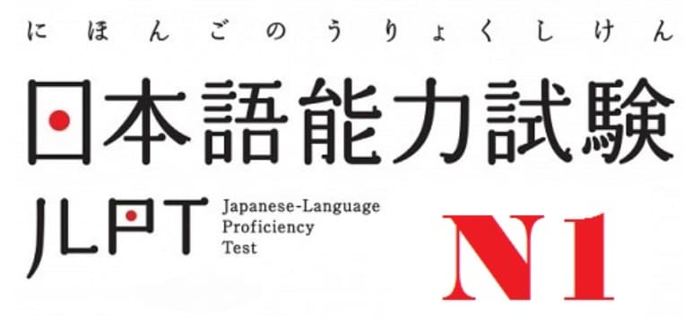

<h2>Hello 👋, I'm Kyle Zhou</h2>

I'm a software developer.I do frontend and backend.

<h2>🚀 Some Tools I Use</h2>

  
  
  
  
  
  
  
  
  
  

  
  
  
  
  
  
  
  
  
  
  

<h2>💡 Other skills</h2>

